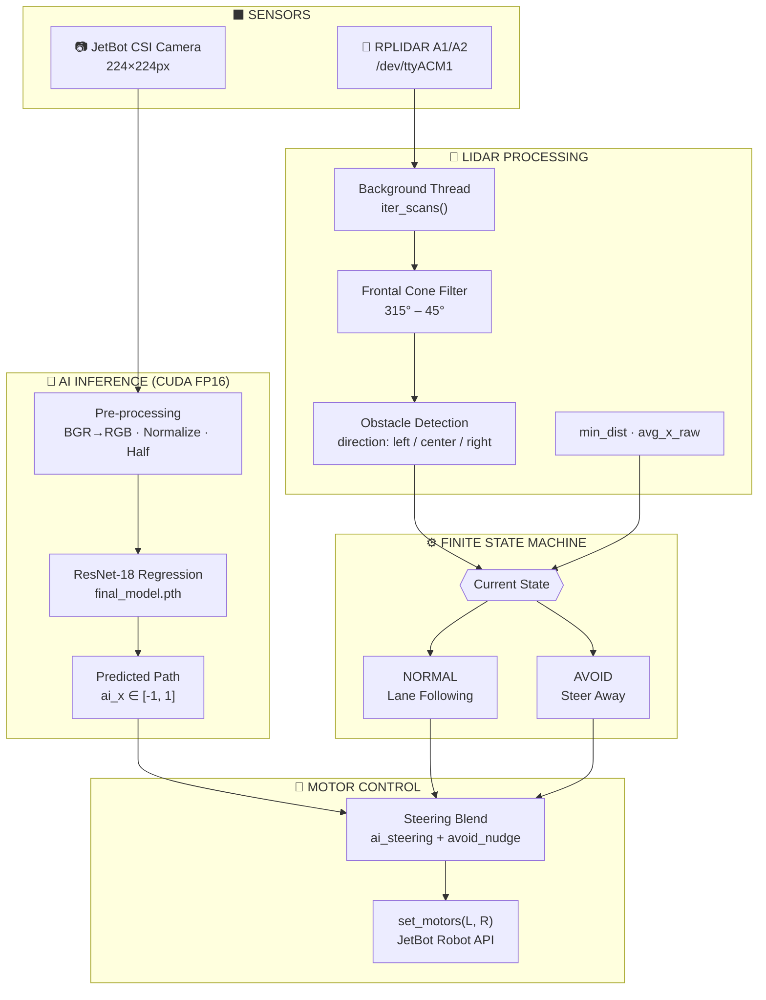
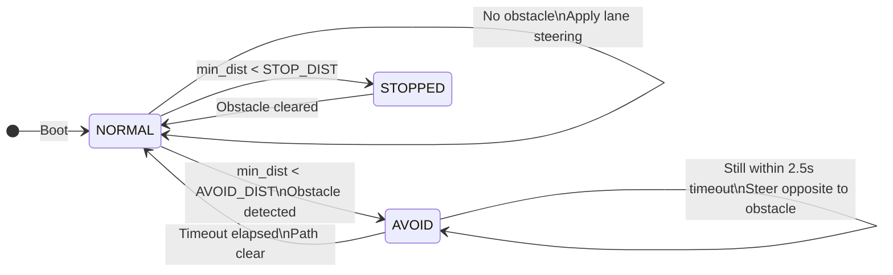

<div align="center">

# Autonomous JetBot

### AI Lane Following & LiDAR Obstacle Avoidance
*NVIDIA Jetson Nano · ResNet-18 · RPLIDAR A1/A2*

---

[](https://python.org)
[](https://pytorch.org)
[](https://developer.nvidia.com/cuda-toolkit)
[](https://developer.nvidia.com/embedded/jetson-nano)
[](https://opencv.org)
[](LICENSE)
[](https://jetbot.org)

</div>

---

## Overview

The project combines **deep learning visual steering** with **real-time LiDAR obstacle detection** to achieve fully autonomous navigation on a JetBot platform. A fine-tuned ResNet-18 regression network predicts the robot's path from a live camera feed, while an RPLIDAR A1/A2 sensor guards against collisions. A lightweight **Finite State Machine** fuses both signals — the robot follows lanes at 14 Hz, and seamlessly swerves around obstacles when the LiDAR detects a threat.

---

## System Architecture



---

## Finite State Machine



---

## Hardware Requirements

| Component | Specification | Notes |
|---|---|---|
| **Robot Platform** | NVIDIA JetBot | Jetson Nano 4GB |
| **GPU** | Jetson Nano integrated CUDA | FP16 half-precision inference |
| **Camera** | CSI Camera Module | 224 × 224 px, onboard |
| **LiDAR** | RPLIDAR A1 or A2 | UART `/dev/ttyACM1`, 115200 baud |
| **Storage** | ≥ 32 GB microSD | For OS, datasets, and model weights |
| **Power** | 5V 4A barrel jack | Or battery pack for untethered operation |

---

## Project Structure

```
BIP-Group-5/
│
├── 📂 Application/
│   ├── camera_capture.py        ← Jupyter live-prediction widget (JetBot cam)
│   ├── train.py                 ← ResNet-18 classification training pipeline
│   └── txt/                     ← Label / annotation text files
│
├── 📂 Lane Following/
│   ├── Lane_Follower.py         ⭐ MAIN — Full multi-threaded integration runner
│   ├── Lane_v1.py               ← First-pass lane follower
│   ├── Pure_pursuitv0.1.py      ← Pure Pursuit steering controller
│   ├── Training.ipynb           ← Regression training notebook (Jupyter)
│   ├── conversion.py            ← Model/data format conversion utilities
│   ├── frame.py                 ← Frame extractor for Lane Following dataset
│   └── main.py                  ← Standalone lane following entry point
│
├── 📂 notebooks/
│   ├── basic_motion/            ← JetBot official motion notebooks
│   ├── collision_avoidance/     ← JetBot official collision avoidance
│   ├── object_following/        ← JetBot official object following
│   ├── road_following/          ← JetBot official road following
│   ├── teleoperation/           ← JetBot official teleoperation
│   └── Demonstration/           ← Group demo notebooks
│
├── 📂 test/
│   ├── main.py                  ← FSM integration entry point (~14 Hz loop)
│   ├── fsm.py                   ← Finite State Machine (NORMAL ↔ AVOID)
│   ├── detection.py             ← LiDAR obstacle detector (cone + distance)
│   ├── lidar.py                 ← PyRPlidar wrapper class
│   └── lane_placeholder.py      ← Steering stub for FSM testing
│
├── 📂 training_videos/          ← Raw driving footage for dataset creation
│
├── frame.py                     ← Video → 224×224 frame extractor (root)
├── lidar.py                     ← Standalone LiDAR connectivity test
└── final_model.pth              ← Trained ResNet-18 weights (production)
```

---

## Configuration Parameters

### Driving & Steering

| Parameter | Default | Description |
|---|---|---|
| `speed_gain` | `0.15` | Base forward speed (0.0 – 1.0) |
| `steering_gain` | `0.12` | AI x-offset → steering magnitude |
| `steering_kd` | `0.04` | Derivative damping on steering |
| `avoid_nudge` | `±0.4` | Steering offset applied during avoidance |

### LiDAR Thresholds

| Parameter | Default | Description |
|---|---|---|
| `STOP_DIST` | `200 mm` | Hard stop — obstacle too close |
| `AVOID_DIST` | `550 mm` | Trigger avoidance manoeuvre |
| `SAFE_CORRIDOR` | `150 mm` | Lateral tolerance around predicted path |
| Frontal cone | `315° – 45°` | Angular window monitored for obstacles |

### Frame Extraction

| Parameter | Default | Description |
|---|---|---|
| `SKIP_FRAMES` | `7` | Sample every Nth frame from video |
| `TARGET_SIZE` | `224 × 224` | Output resolution (matches ResNet-18 input) |

### Training

| Parameter | Default | Description |
|---|---|---|
| `batch_size` | `32` | DataLoader batch size |
| `epochs` | `50` | Training epochs |
| `learning_rate` | `0.0001` | Adam optimiser LR |
| Normalisation | ImageNet µ/σ | `[0.485,0.456,0.406]` / `[0.229,0.224,0.225]` |

---

## Setup & Installation

### 1 — Flash & Prepare JetBot

Flash your Jetson Nano SD card with the official JetBot image, then boot and connect via Jupyter Lab on `http://<jetbot-ip>:8888`.

```bash
# Verify GPU and CUDA are available
python3 -c "import torch; print(torch.cuda.is_available())"
```

### 2 — Clone the Repository

```bash
git clone https://github.com/<your-org>/BIP-Group-5.git
cd BIP-Group-5
```

### 3 — Install Dependencies

```bash
pip install torch torchvision opencv-python rplidar-roboticia pyrplidar tqdm ipywidgets
```

> **Note:** On Jetson, PyTorch should be installed from NVIDIA's pre-built wheel for your JetPack version.

### 4 — Collect Training Data

Drive the JetBot manually (teleoperation notebook) and record video to `training_videos/`. Then extract frames:

```bash
python frame.py
# Outputs 224×224 frames to dataset_all/ at every 7th frame
```

### 5 — Label the Dataset

Annotate frames with (x, y) steering targets using a labelling tool or the JetBot road-following notebook workflow. Organise into `datasets/train/` and `datasets/test/`.

### 6 — Train the Model

```bash
python Application/train.py
# Trains ResNet-18 for 50 epochs, saves resnet18.pth
```

For lane regression training, open the Jupyter notebook:

```bash
# In Jupyter Lab on JetBot:
# Open → Lane Following/Training.ipynb
```

### 7 — Deploy the Final Model

```bash
cp resnet18.pth final_model.pth
# Or copy your best checkpoint from Training.ipynb
```

---

## Running the Robot

### Full Integration (Recommended)

Open `Lane Following/Lane_Follower.py` in Jupyter Lab on the JetBot. This script runs **everything** in one place:

- Starts the RPLIDAR background thread
- Loads ResNet-18 with CUDA FP16
- Streams the camera through the model at ~14 Hz
- Blends AI steering with LiDAR avoidance nudge
- Renders a live overlay (green path line, red avoidance dot)

```
# In Jupyter Lab → open Lane Following/Lane_Follower.py and run all cells
# Press the STOP ROBOT button to halt safely
```

### FSM Test (Modular)

```bash
# On JetBot terminal — tests FSM + LiDAR + stub steering
python test/main.py
# Press Ctrl+C to stop
```

### LiDAR Connectivity Test

```bash
python lidar.py
# Prints device info, health, and first 5 scans
```

---

## How It Works

### Lane Following

The camera captures a `224×224` BGR frame. It is converted to RGB, normalised with ImageNet statistics, and passed through ResNet-18 in **FP16** on the Jetson GPU. The model outputs `ai_x ∈ [−1, 1]` — the predicted horizontal offset of the lane centre. This is converted to differential motor speeds:

```
steering = (ai_x × steering_gain) + (Δai_x × steering_kd)
left_motor  = speed_gain + steering
right_motor = speed_gain − steering
```

### Obstacle Avoidance

The RPLIDAR runs in a **daemon thread**, continuously scanning a frontal 90° cone (`315°–45°`). Each scan yields `min_dist` (closest point) and `avg_x_raw` (horizontal centroid of danger points). The FSM transitions:

- `min_dist < STOP_DIST (200mm)` → **full stop**
- `min_dist < AVOID_DIST (550mm)` AND obstacle overlaps predicted path → `AVOID` state, inject `avoid_nudge = ±0.4`
- 2.5 s elapsed in `AVOID` → return to `NORMAL`

### Steering Blend

```
avoid_nudge  = −0.4  if obstacle is to the right of path
avoid_nudge  = +0.4  if obstacle is to the left of path
total_steer  = ai_steering + avoid_nudge
```

The JetBot smoothly merges AI intent with reactive safety — neither overrides the other completely.

---

## Acknowledgements

- [NVIDIA JetBot](https://jetbot.org) — open-source AI robot platform
- [PyTorch](https://pytorch.org) — deep learning framework
- [RPLIDAR SDK](https://github.com/Roboticia/RPLidar) — Python LiDAR driver
- [JetBot Official Notebooks](https://github.com/NVIDIA-AI-IOT/jetbot) — base reference notebooks

---

